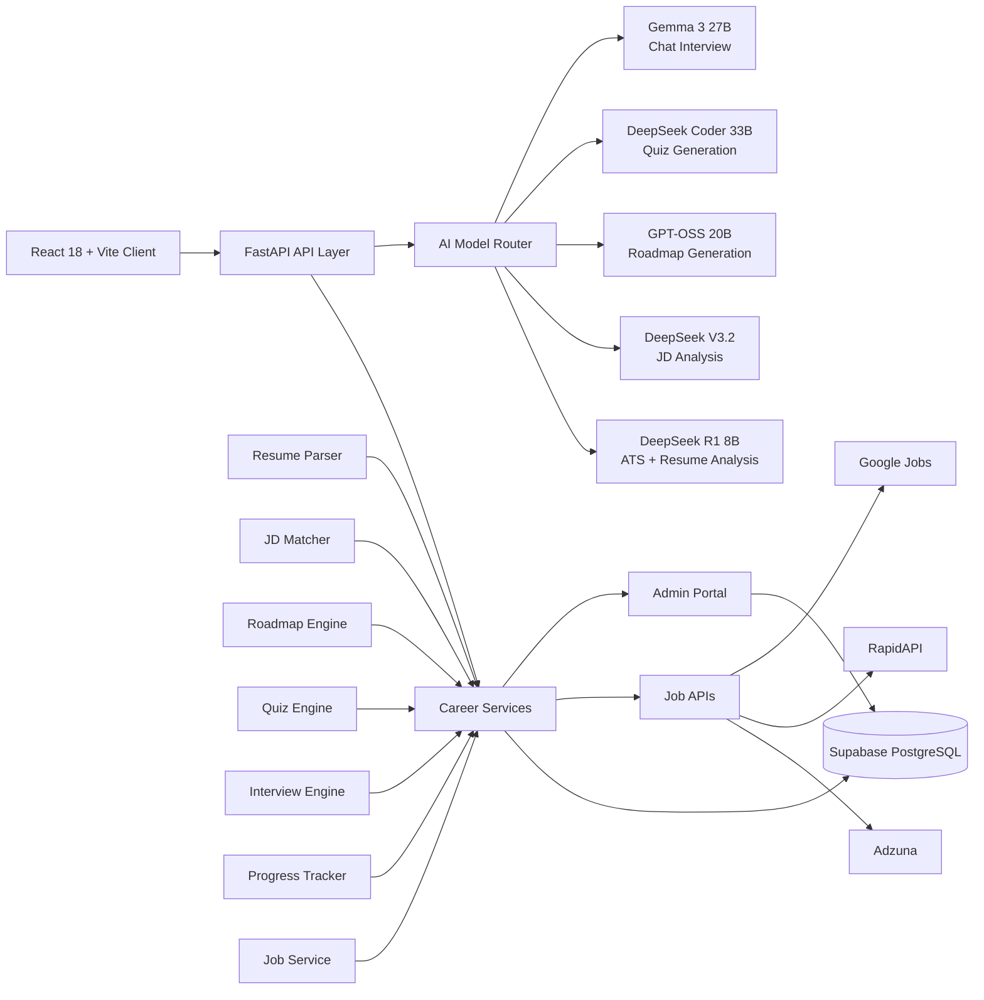

# SkillBridge AI

An agentic career operating system that analyzes resumes, finds skill gaps, builds a roadmap, tests progress, runs mock interviews, and helps candidates move toward placement in one adaptive loop.


## Overview

SkillBridge AI is built as a full-stack platform for career preparation. Instead of giving one-time feedback, it keeps evaluating performance and routes the user to the next best action: revise, practice more, or move toward interviews and job applications.

## Core Features

- Resume analysis with ATS-focused scoring and improvement suggestions.
- JD matching and skill-gap detection with priority-based focus areas.
- Personalized roadmap generation that updates with performance.
- Adaptive quiz engine for MCQs and coding rounds.
- Chat-based mock interviews with scored feedback.
- Progress tracking with decision logic for next steps.
- Job matching across external sources with resume-fit signals.
- Admin portal to manage student entries, control access, and set eligibility criteria.

## Architecture



## Tech Stack

**Frontend**
- React 18
- Vite
- Axios
- React Dropzone
- Framer Motion

**Backend**
- FastAPI
- Python 3.9+
- Pydantic
- PyMuPDF
- python-docx

**Database and Admin**
- Supabase for PostgreSQL, auth, storage, and RLS.
- Admin portal for managing student entries, cohort visibility, and eligibility criteria.

## AI Model Routing

| Model | Purpose |
|---|---|
| DeepSeek R1 8B | ATS scoring and resume analysis |
| DeepSeek V3.2 | JD analysis and gap detection |
| GPT-OSS 20B | Personalized roadmap generation |
| DeepSeek Coder 33B | Quiz generation and coding evaluation |
| Gemma 3 27B | Chat-based mock interview |

## API Surface

| Method | Endpoint | Description |
|---|---|---|
| POST | `/api/resume/upload` | Upload and parse resume |
| POST | `/api/resume/analyze` | ATS scoring and suggestions |
| POST | `/api/jd/match` | Match resume with job description |
| POST | `/api/roadmap` | Generate learning roadmap |
| POST | `/api/quiz/generate` | Generate adaptive quiz |
| POST | `/api/quiz/evaluate` | Evaluate answers and weak areas |
| POST | `/api/interview/start` | Start interview session |
| POST | `/api/interview/evaluate` | Score interview answers |
| GET | `/api/progress/{id}` | Fetch learner progress |
| POST | `/api/jobs/search` | Search matched jobs |
| GET | `/api/admin/students` | Admin student listing |
| POST | `/api/admin/eligibility` | Set eligibility criteria |

## Quick Start

```bash
# Windows
start.bat
```

Manual setup:

```bash
# Backend
cd backend
python -m venv venv
venv\Scripts\activate
pip install -r requirements.txt
python -m uvicorn main:app --reload --port 8000

# Frontend
cd frontend
npm install
npm run dev
```

## Environment Variables

```env
SUPABASE_URL=your_supabase_url
SUPABASE_KEY=your_supabase_key
ADZUNA_APP_ID=your_adzuna_app_id
ADZUNA_APP_KEY=your_adzuna_app_key
RAPIDAPI_KEY=your_rapidapi_key
```

## Health

- `GET /health`
- `GET /docs`
- `GET /redoc`

SkillBridge AI helps users keep improving until they are interview-ready and placement-ready.
